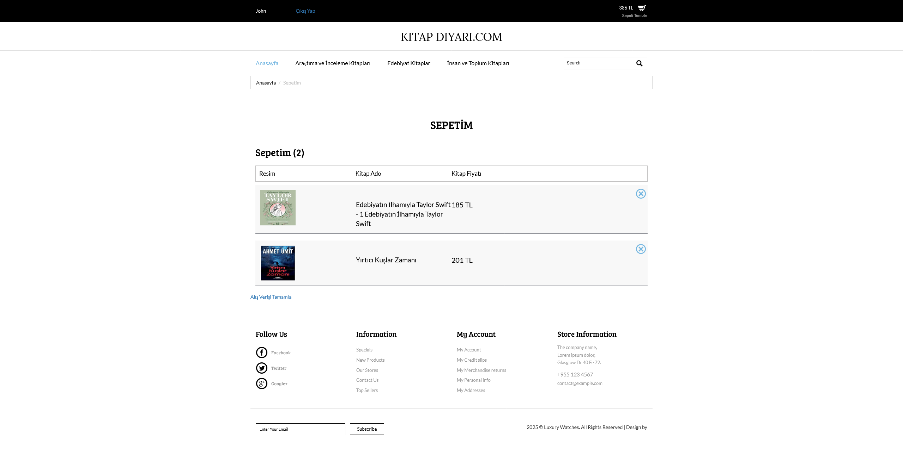

# Laravel e-Book Store/Laravel Backend Project

Kitap alım-satımı için Laravel tabanlı bir uygulama. Bu proje, kullanıcıların kitapları sorunsuz bir şekilde gezinebilecekleri, satın alabilecekleri ve satabilecekleri bir platform oluşturmayı hedeflemektedir.

## Özellikler

- Kullanıcı ve Admin Sayfaları.
- Yazar, kitap, kategori ve yayınevi eklenebilir, düzenlenebilir ve silinebilir.
- Kullanıcı, ücretsiz olarak kayıt olabilir.
- Kullanıcı, ürünü sepete ekleyebilir ve sepetten silebilir.
- Admin, ürün ekleyebilir, çıkarabilir ve güncelleyebilir.
- Admin, her bir siparişi görüntüleyebilir, detaylarını inceleyebilir ve silebilir.
- Çok daha fazla özellik.

## Ekran Görüntüleri

<h3>Admin Panel</h3>

<h3>YayınEvi</h3>

<h3>Yazarlar</h3>

<h3>Kategoriler</h3>

<h3>Kitaplar</h3>

<h3>Kitap Ekleme</h3>

<h3>Kitap Düzenleme</h3>

<h3>Slider</h3>

<h3>Siparişlerim</h3>

<h3>Ana Sayfa</h3>

<h3>Ana Sayfa 2</h3>

<h3>Kayıt Ol</h3>

<h3>Giriş Yap</h3>

<h3>Arama Çubuğu Sayfası</h3>

<h3>Sepet</h3>

<h3>Alışverişi Tamamlama</h3>

